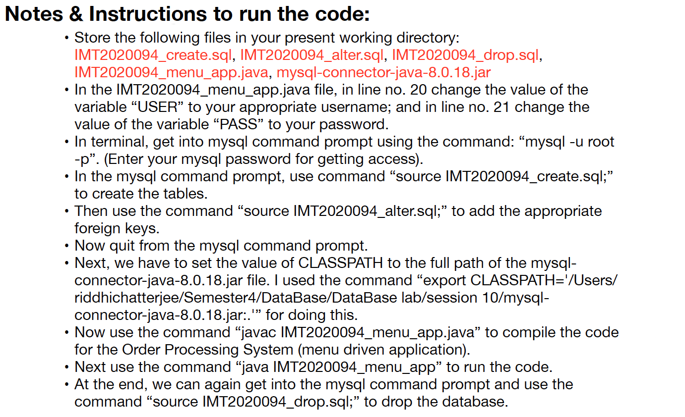

# Order Processing System
* This is the implementation of an Order Processing System for an online store.
* This system can be used by some Store Manager to keep track of the customers, the orders placed, and the products of the store.
* Once an order is delivered (i.e. when current date becomes >= delivery date of the order), that particular order is removed from the Order table and all the products which were part of that order are removed from the Product table. This happens automatically when the customers or the store manager queries the data.
* If some customer cancels an order which has not been delivered yet, then that order is removed from the Order table, but the products which were part of that order are not removed from the Product table.

  

